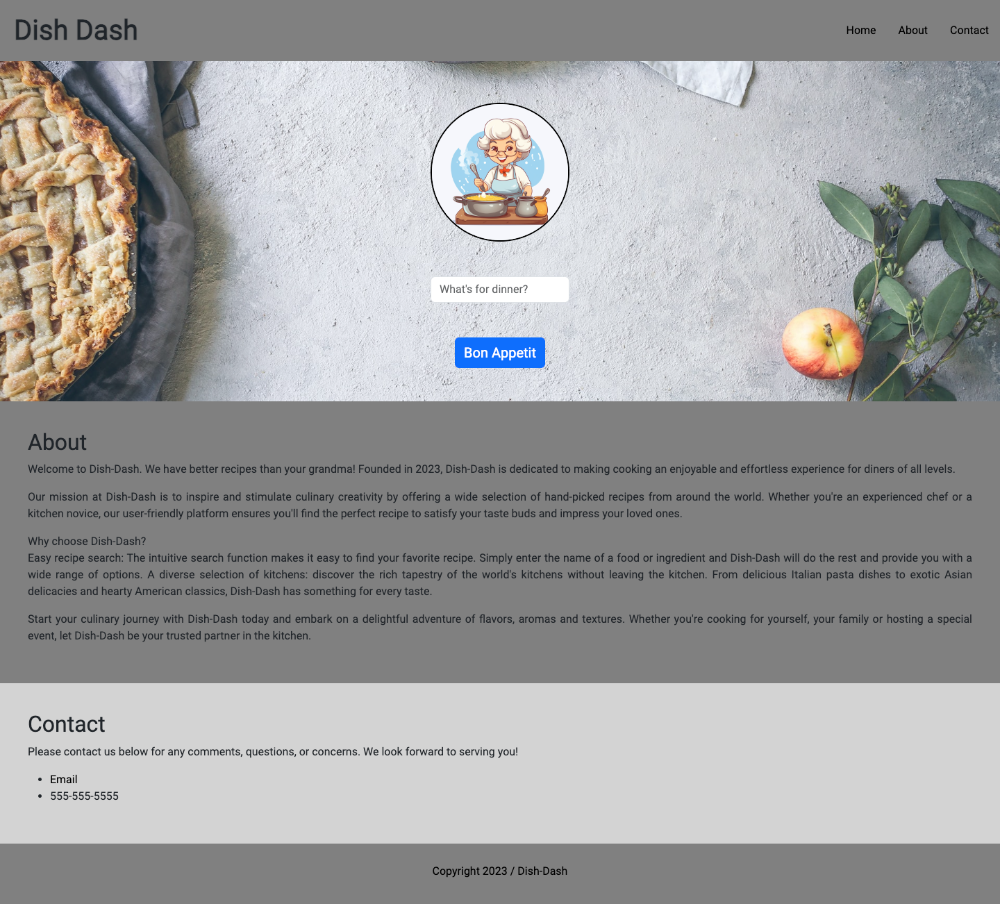

# Dish-Dash

## Description 
Dish-Dash is a Website that offers users the ability to search for and save recipes. Dish-Dash is dedicated to making cooking an enjoyable and effortless experience for diners and cooks of all levels. Our purpose is to inspire and stimulate culinary creativity by offering a wide selection of hand-picked recipes from around the world. Whether you're an experienced chef or a kitchen novice. We offer a user friendly platform where users are able to easily search for recipes by simply typing in the name inside the input and hitting the search button. 
Our project contains the following: html, css, javascript, bootstrap, and API. 

## Installation
This website can be deployed using github pages link.

Information on how to do this can be found here:

https://dev.to/github/how-to-host-your-first-site-for-free-on-github-pages-45ob

## Usage
When you open this website, a landing page appears with a header that features several links 
Users are able to search for any receipt in any given moment. Once a recipe is chosen, users are prompted with a recipe image, ingredients, and a video link to learn how to cook the recipe from an instructional video. Furthermore, users are able to store their favorite recipes to local storage in the console log by clicking a save to favorites button. 

Link to repo:
https://github.com/brennysouza/dish-dash

Link to deployed site:
https://brennysouza.github.io/dish-dash/

## Credits
This project has four contributors.

Ronnie Curcurato
https://github.com/Rcurcurato

Victor Nieves
https://github.com/PC-Vic

Brenny Souza
https://github.com/brennysouza

Luis Torillo
https://github.com/Luistj03

*Some code was supplied by TA's only as starting points to assist. 

## License
Please refer to the LICENSE found in repo. 
